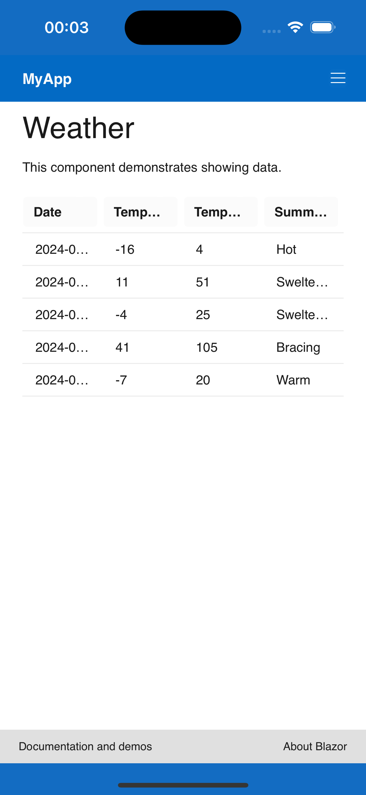
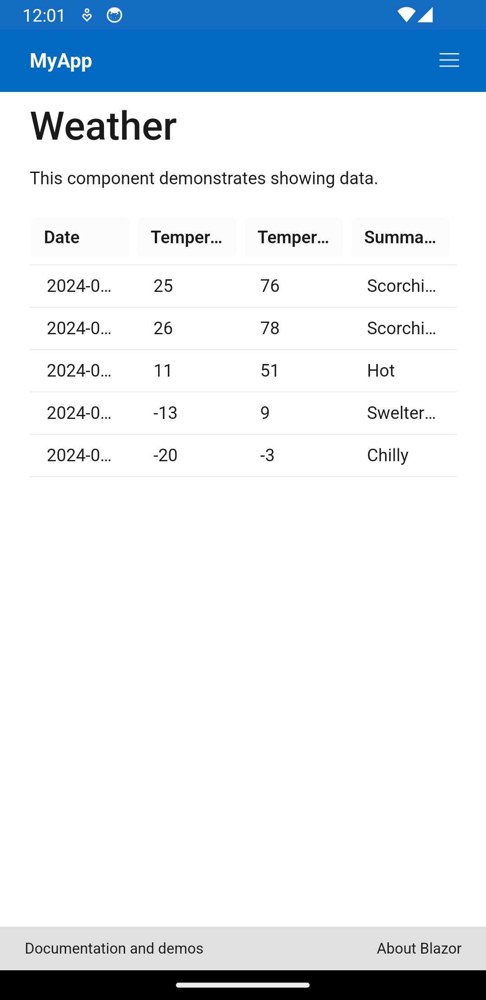
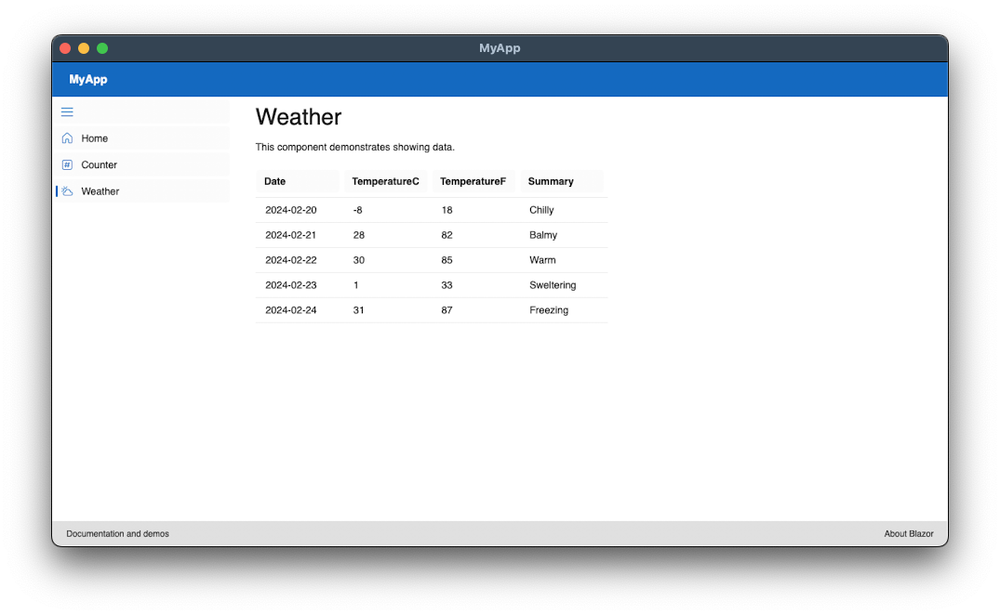

# MyApp

MAUI Blazor Hybrid with backend Web API.

MAUI, Blazor, Fluent UI, NSwag (for Open API), MAUI Community Toolkit

## Screenshots



iPhone



Android



MacOS (Catalyst)

## Connect to backend (MyApi)

The easiest way for the mobile apps to connect to the backend is using DevTunnel.

```
devtunnel host -p 5286 -a
```

``-a`` means anonymous - the connection will not prompt for login

Make sure to update the URL in MauiProgram.cs.

```csharp
builder.Services.AddHttpClient("MyApi", httpClient =>
{
    httpClient.BaseAddress = new Uri("https://6m3d3pnd-5286.euw.devtunnels.ms");
});
```

## Run database

To start the Postgresql database:

```
docker compose up
```
